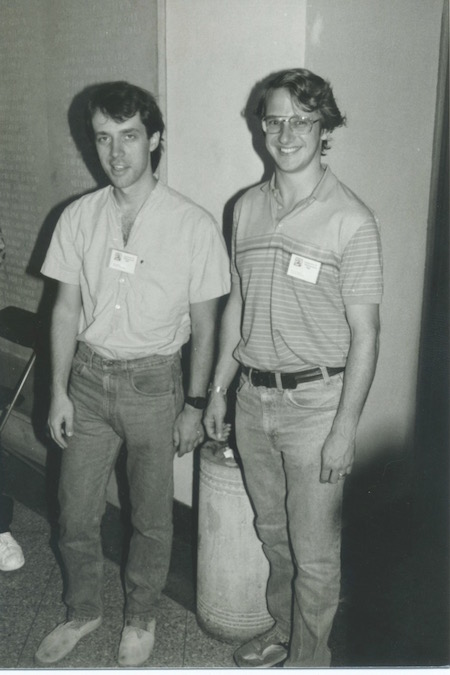

## About the event

A conference and software development workshop will be held July 17-21, 2017 at the University of California, Berkeley. The first two days of the meeting will be a conference on free resolutions and commutative algebra and the rest of the time will be spent hosting a Macaulay2 workshop.

## Confirmed Speakers

* Christine Berkesch Zamaere
* Giulio Caviglia
* Andre Galligo
* Mel Hochster
* Sonja Mapes
* Jason McCullough
* Irena Peeva
* Alexandra Seceleanu
* Frank-Olaf Schreyer
* Ravi Vakil

## Scientific Committee

* David Eisenbud (Berkeley)
* Sonja Mapes (Notre Dame)
* Hal Schenck (Illinois)
* Branden Stone (Adelphi University)
* David Swinarski (Fordham)
* Amelia Taylor (Zymergen, Inc.)

## Local Organizers

* Justin Chen
* Mengyuan Zhang

## Funding Source

This event was supported by the National Science Foundation under Grant Number DMS-1701922. Any opinions, findings, and conclusions or recommendations expressed in this material are those of the author(s) and do not necessarily reflect the views of the National Science Foundation.
